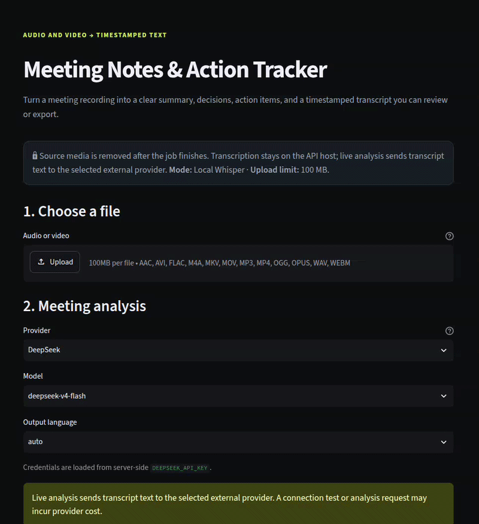

# Meeting Notes & Action Tracker

Turn an audio or video recording into a timestamped transcript and structured
meeting notes: summary, decisions, action items, follow-ups, and open questions.

[](https://github.com/snikmas/transcriber_app/actions/workflows/quality.yml)




## Why it is useful

- **Save review time:** turn long recordings into readable notes and searchable text.
- **Keep the evidence:** every transcript segment includes timestamps.
- **Choose your AI provider:** OpenAI, Anthropic, OpenRouter, DeepSeek, or a
  compatible custom endpoint.
- **Export the result:** download meeting notes, transcripts, or combined data
  as Markdown, TXT, or JSON; SRT is available through the API.

Useful for meetings, interviews, lectures, research recordings, and internal
video updates.

## How it works

1. Upload an audio or video file up to 100 MB.
2. Local `faster-whisper` creates the timestamped transcript.
3. The selected provider turns the transcript into structured notes.
4. Review the result, reopen it from history, or download an export.

Source media is removed after processing. The transcript and validated meeting
notes stay in the local SQLite history until the job is deleted.

> Provider keys are backend-only. They are loaded from `.env`, never entered in
> the browser, and never stored in jobs or exports. Live analysis sends the
> transcript text to the selected external provider.

## Quick start

### Docker Compose (recommended)

```bash
git clone https://github.com/snikmas/transcriber_app.git
cd transcriber_app
cp .env.example .env
# Add one provider key to .env, for example DEEPSEEK_API_KEY.
docker compose up --build
```

Open [http://localhost:8501](http://localhost:8501). The API is available at
[http://localhost:8000/docs](http://localhost:8000/docs).

The first real transcription downloads and caches the configured Whisper model.

<details>
<summary>Run with Python instead</summary>

```bash
git clone https://github.com/snikmas/transcriber_app.git
cd transcriber_app
cp .env.example .env
uv sync --extra local
uv run uvicorn main:app
```

In a second terminal:

```bash
API_URL=http://127.0.0.1:8000 uv run streamlit run ui/app.py
```

</details>

## Included

- Local speech recognition with `faster-whisper`
- Audio and video uploads with automatic video-to-audio conversion
- DeepSeek, OpenAI, Anthropic, OpenRouter, and custom provider support
- Structured summaries, decisions, action items, follow-ups, and open questions
- Timestamped transcript and durable local job history
- Markdown, TXT, and JSON downloads, plus SRT export through the API
- FastAPI, Streamlit, SQLite, Docker Compose, and 136 offline tests

## Architecture

```text
Streamlit UI
    │ upload + provider selection
    ▼
FastAPI API ─── SQLite job state
    │
    └── in-process worker
          ├── local faster-whisper transcription
          └── configured external analysis provider
```

The project is designed for local or small-team use. See
[`docs/ARCHITECTURE.md`](docs/ARCHITECTURE.md) for the data flow and
[`docs/PRIVACY.md`](docs/PRIVACY.md) for the trust boundary.

## Development

```bash
uv sync --extra local --group dev
uv run pytest -q
uv run ruff check .
uv run ruff format --check .
docker compose config --quiet
```

The automated checks are offline: they do not call paid providers or use
personal recordings.

Developer details: [`DEVELOPER_SUMMARY.md`](DEVELOPER_SUMMARY.md) ·
[`RELEASE_NOTES.md`](RELEASE_NOTES.md)

## Current boundaries

The release does not include authentication, speaker diarization, real-time
capture, transcript editing, Zoom/Meet integrations, CRM sync, or distributed
workers. It is a local/small-team application, not a hosted multi-tenant SaaS.

Speech recognition and AI-generated notes can contain mistakes. Review results
before using them for decisions, commitments, or official records.

## License

MIT. See [`LICENSE`](LICENSE).
