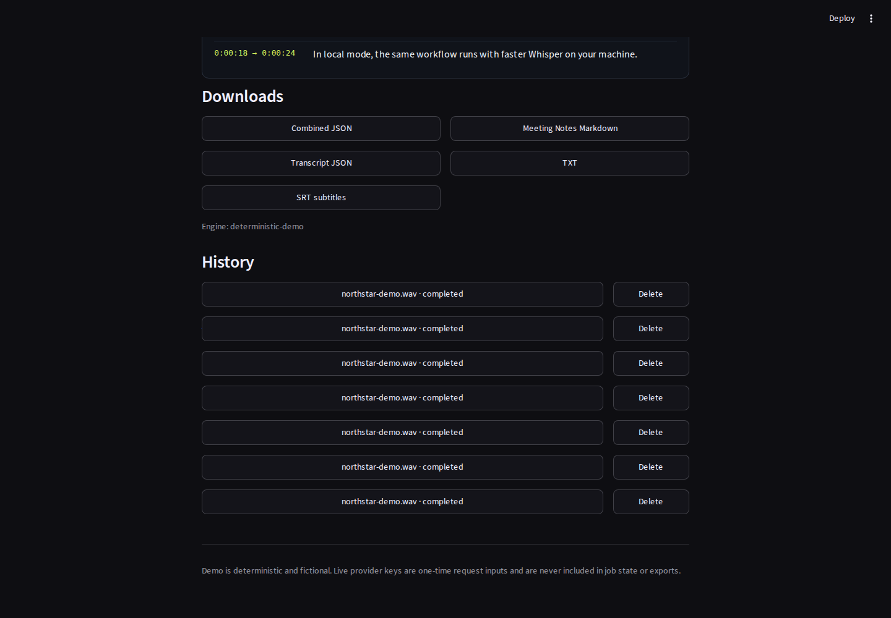
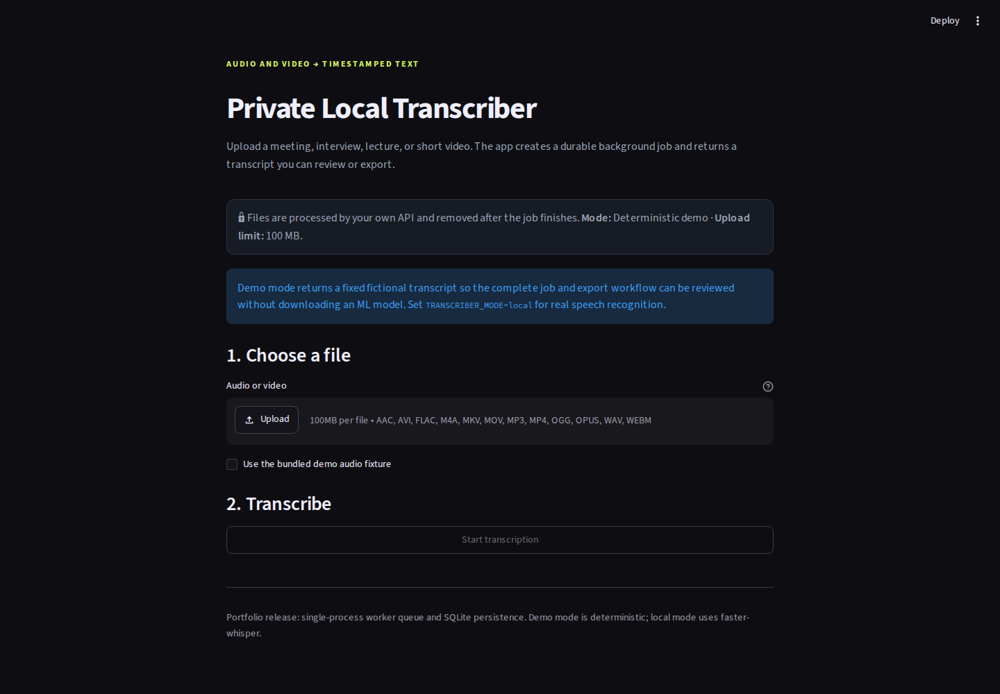
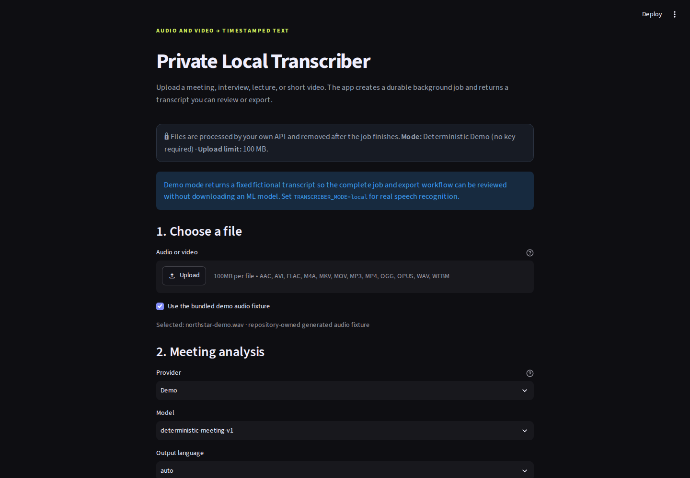
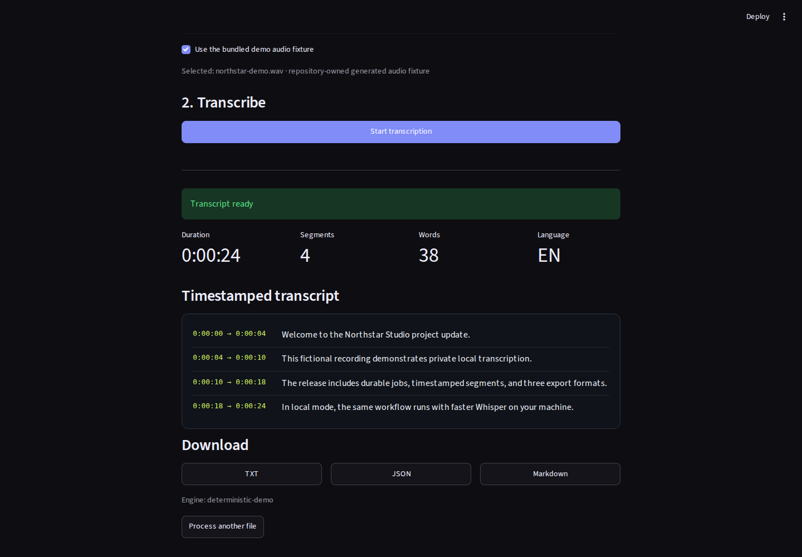

# Meeting Notes & Action Tracker

**Turn a recording into a durable transcript and structured meeting notes.**

[](https://github.com/snikmas/transcriber_app/actions/workflows/quality.yml)


This is a small, portfolio-ready Python product: a clear Streamlit workflow,
documented FastAPI API, background processing, durable SQLite job state,
schema-validated meeting analysis, exportable results, Docker delivery, and
automated quality checks.

It runs in two clearly separated modes:

- **Demo mode** shows the complete workflow immediately with fixed fictional
  transcript/analysis and no model download or provider key.
- **Local mode** performs real speech recognition on the machine running the API
  with faster-whisper.



The bundled `northstar-demo-60s.wav` fixture is a deterministic 72-second
mono WAV made from original tones; it contains no real or copyrighted speech.
See [`samples/README.md`](samples/README.md) for the exact regeneration command.

> **Current UI evidence (2026-08-11):** These screenshots show the repository's
> deterministic Demo workflow as it exists today. The older screenshots below
> are retained only as explicitly labeled legacy release evidence.

## The problem it solves

Meetings, interviews, lectures, and short videos often need to become searchable,
reusable text. This application turns an uploaded media file into a timestamped
transcript, then (optionally) into a summary, decisions, action items, open
questions, and follow-ups that can be reviewed or exported.

The release covers the complete path from upload to export:

1. Upload a file or choose the repository-owned fictional fixture.
2. Create a durable background job and track both transcription and analysis.
3. Review meeting notes beside timestamped transcript segments.
4. Download combined JSON, Meeting Notes Markdown, transcript JSON, transcript Markdown, or TXT.
5. Reopen results from history; temporary source media is removed after processing.

## What this project demonstrates

| Client need | Implemented solution |
| --- | --- |
| A simple, understandable workflow | Responsive Streamlit interface with a bundled demo fixture |
| Audio and video input | 12 accepted formats, including MP3, WAV, M4A, MP4, MOV, and WebM |
| Safe handling of larger uploads | Streaming writes in 1 MB chunks with a configurable size limit |
| Work that may take longer than one request | Background worker with stable job IDs and status polling |
| Durable job records | SQLite-backed job metadata, status, errors, and transcript JSON |
| Local/private speech recognition | Lazy-loaded faster-whisper model with an offline-after-caching option |
| Useful deliverables | Transcript TXT/JSON/Markdown plus combined JSON and Meeting Notes Markdown |
| Predictable recovery | Interrupted jobs are marked failed after restart instead of remaining stuck |
| Cleanup of source media | Each upload uses an isolated directory that is removed after success or failure |
| Reproducible delivery | Docker Compose, portable tests, linting, formatting checks, and GitHub Actions |

## Upload workflow

### Upload a file or use the bundled demo



The current Demo controls include meeting-analysis provider/model selection and
the repository-owned fixture:



The current result view includes structured meeting notes, timestamped
transcript segments, export buttons, and durable history:


The upload and result screenshots below are legacy captures from an earlier UI
release; they are not the current control or export layout.



## Try the demo locally

The demo uses Python 3.12 and does not download a speech-recognition model.

```bash
git clone https://github.com/snikmas/transcriber_app.git
cd transcriber_app
python3.12 -m venv .venv
source .venv/bin/activate
pip install -e .
```

Start the API in the first terminal:

```bash
uvicorn main:app
```

Start the interface in a second terminal with the same virtual environment activated:

```bash
streamlit run ui/app.py
```

Open `http://localhost:8501`, select **Use the bundled demo audio fixture**,
choose **Demo**, and click **Start transcription and analysis**.

> Demo mode returns fixed fictional transcript and meeting analysis. It proves
> the upload, background job, persistence, polling, notes, and export workflow
> without pretending to recognize the demo audio.

Interactive API documentation is available at `http://localhost:8000/docs`.

## Run real local transcription

Install `ffmpeg`, then install the optional local-inference dependencies:

```bash
pip install -e ".[local]"
```

Start the API in local mode:

```bash
TRANSCRIBER_MODE=local uvicorn main:app
```

Start the Streamlit interface in another terminal:

```bash
streamlit run ui/app.py
```

The default `tiny` model downloads on the first local-mode job and is reused afterward. Processing time and accuracy depend on the selected model, hardware, language, audio quality, and recording length.

After the model is cached, require a fully offline runtime with:

```bash
WHISPER_OFFLINE=true TRANSCRIBER_MODE=local uvicorn main:app
```

## Run with Docker

The Compose configuration starts both the API and the Streamlit interface. Its
default mode is the deterministic Demo with meeting analysis enabled:

```bash
docker compose up --build
```

Open `http://localhost:8501` when both services are healthy.

Run real local transcription through Docker with:

```bash
TRANSCRIBER_MODE=local docker compose up --build
```

Compose keeps the SQLite database and Hugging Face model cache in named volumes.
Temporary uploaded media is removed after every completed or failed job. The
analysis settings and empty-safe provider key variables are passed through to
the API; never put a real credential in this repository.

## How it works

```text
Browser
  │
  │ upload and status polling
  ▼
Streamlit UI
  │
  │ multipart request
  ▼
FastAPI intake ── validates type, sanitizes name, enforces size limit
  │
  ├── SQLite job repository
  │
  └── in-process queue
         │
         ▼
     background worker
         │
         ├── demo engine
         └── faster-whisper + ffmpeg
                  │
                  ▼
       persisted transcript or bounded error
                  │
                  ▼
     meeting analysis queue (optional)
         │
         ├── deterministic Demo
         └── OpenAI / Anthropic / OpenRouter / PackyAPI / Custom
                  │
                  ▼
       schema-validated notes + transcript exports
```

This single-worker design is intentional for a local/private product
demonstration. A larger deployment would replace SQLite and the in-process
queues with shared production services.

Read the deeper [architecture explanation](docs/ARCHITECTURE.md) and [privacy and limitations](docs/PRIVACY.md).

## API reference

| Method | Endpoint | Purpose |
| --- | --- | --- |
| `GET` | `/health` | Return transcription and analysis readiness without exposing keys |
| `POST` | `/transcribe` | Validate an upload and return a durable job ID |
| `GET` | `/transcribe/{job_id}` or `/jobs/{job_id}` | Return transcription and analysis status/results |
| `GET` | `/jobs?limit=20` | List recent jobs; the API clamps the limit to 1–100 |
| `POST` | `/jobs/{job_id}/analysis` | Queue meeting analysis (`/transcribe/...` alias retained) |
| `GET` | `/jobs/{job_id}/analysis` | Read analysis status/result |
| `POST` | `/jobs/{job_id}/analysis/retry` | Retry analysis without retranscription |
| `DELETE` | `/jobs/{job_id}` | Delete a terminal job; active jobs return `409 Conflict` |

Submit an audio file:

```bash
curl -F "file=@meeting.mp3" http://localhost:8000/transcribe
```

The API accepts the job with HTTP `202`:

```json
{
  "job_id": "16d6f30d-6ee2-4477-9e0b-349fd55e8736",
  "status": "queued",
  "status_url": "/transcribe/16d6f30d-6ee2-4477-9e0b-349fd55e8736"
}
```

Completed results include detected language, confidence, duration, word count,
normalized segment times, display timestamps, full text, engine name, and (when
requested) schema-validated meeting analysis. If analysis fails, the overall
status is `partial_success`: the transcript remains available and retry does
not repeat transcription.

## Configuration

Copy [.env.example](.env.example) as a reference when changing the defaults.

| Variable | Default | Purpose |
| --- | --- | --- |
| `TRANSCRIBER_MODE` | `demo` | Select `demo` or real `local` inference |
| `WHISPER_MODEL` | `tiny` | Choose the faster-whisper model |
| `WHISPER_DEVICE` | `cpu` | Select the inference device |
| `WHISPER_COMPUTE_TYPE` | `int8` | Select the CTranslate2 compute type |
| `WHISPER_OFFLINE` | `false` | Require the model to be available in the local cache |
| `DATABASE_PATH` | `data/jobs.sqlite3` | Set the SQLite database path |
| `UPLOAD_DIR` | `data/uploads` | Set the temporary upload directory |
| `MAX_UPLOAD_MB` | `100` | Set the streaming upload limit; minimum value is 1 MB |
| `POLL_INTERVAL_SECONDS` | `0.5` | Set the UI status-polling interval |
| `ANALYSIS_MODE` / `ANALYSIS_PROVIDER` | `demo` / `demo` | Select deterministic Demo or environment-driven live analysis |
| `ANALYSIS_MODEL` / `ANALYSIS_BASE_URL` | `deterministic-meeting-v1` / empty | Model and PackyAPI/custom endpoint |
| `ANALYSIS_OUTPUT_LANGUAGE` | `auto` | Requested notes language |
| `ANALYSIS_TIMEOUT_SECONDS` / `ANALYSIS_MAX_ATTEMPTS` | `60` / `3` | Bounded provider work |
| `ALLOW_LOCAL_PROVIDER_URLS` | `false` | Explicitly opt in to trusted local custom endpoints |
| `API_URL` | `http://localhost:8000` | Set the API address used by Streamlit |

### Provider choices

The UI supports Demo, OpenAI (Responses API), Anthropic (Messages API),
OpenRouter (OpenAI-compatible chat), PackyAPI (OpenAI-compatible chat), and
Custom OpenAI-compatible or Anthropic-compatible endpoints. PackyAPI requires
the account-specific `ANALYSIS_BASE_URL`; no endpoint is guessed. Provider keys
entered in the UI are one-time request inputs. Environment keys are optional
and map to `OPENAI_API_KEY`, `ANTHROPIC_API_KEY`, `OPENROUTER_API_KEY`,
`PACKYAPI_API_KEY`, or the generic `ANALYSIS_API_KEY`.

Live providers receive transcript text. Demo and local Whisper keep processing
on the API host (apart from the first Hugging Face model download in local
mode). Custom URLs are checked for unsafe/private destinations unless the
explicit local opt-in is enabled.

## Project structure

```text
main.py                    FastAPI application and upload boundary
ui/app.py                  Streamlit workflow and export interface
src/config.py              Environment-based settings
src/database/database.py   SQLite job repository
src/jobs.py                Job creation and queue handoff
src/worker.py              Background processing and cleanup
src/transcriber.py         Demo and faster-whisper engines
src/parsers.py             Normalized transcript result builder
src/analysis/              Meeting schema, chunking, providers, and service
src/exports.py             Transcript, SRT, combined JSON, and notes serializers
tests/                     Portable unit and integration tests
docs/                      Architecture and privacy documentation
DEVELOPER_SUMMARY.md       Current architecture, lifecycle, and extension map
compose.yaml               API, UI, health check, and persistent volumes
```

## Quality checks

The current suite contains 65 test functions plus parameterized cases. It does
not download a model, contact a provider, or use personal media. GitHub Actions
runs the same core checks on every push and pull request.

```bash
uv sync --group dev
uv run pytest -q
uv run ruff check .
uv run ruff format --check .
docker compose config --quiet
git diff --check
```

The tests cover upload validation, size enforcement, filename sanitization,
background processing, persistent results, restart recovery, cleanup, job
deletion rules, deterministic Demo output, video preparation, analysis schema
and provider boundaries, partial success/retry, parsing, and transcript plus
combined export formats.

## Example freelance adaptations

This repository is a working foundation, not a claim that every possible client feature is already included. Depending on the workflow, it can be extended into:

- **Meeting and interview processing:** additional profiles, diarization, summaries, decisions, and action items
- **Media-production workflows:** SRT/VTT subtitles, batch processing, and review queues
- **Internal company tools:** authentication, roles, retention rules, audit logs, and branded UI
- **Research workflows:** searchable transcript archives, tags, structured extraction, and exports
- **Privacy-sensitive deployments:** offline model packaging, on-premise installation, and GPU configuration
- **Larger hosted systems:** PostgreSQL, object storage, distributed workers, webhooks, monitoring, and autoscaling

## Current boundaries

- The release uses one in-process worker, not a distributed task queue.
- SQLite is appropriate for this local/small-team demonstration, not a large multi-user SaaS deployment.
- Authentication, automatic redaction, speaker diarization, real-time capture,
  and multi-tenant hosting are not included.
- Live provider calls are supported through adapters but are not a hosted
  inference service; they can fail, cost money, or receive transcript text
  outside the machine.
- YouTube extraction is intentionally excluded because it is externally fragile.
- Speech recognition can mishear names, accents, overlapping speakers, technical terms, and noisy audio. Important transcripts require human review.

## Need a similar tool?

This project is an example of the Python automation, backend API, local AI, and internal-tool work I can adapt for a specific business workflow.

If you need a transcription pipeline, FastAPI service, Python automation, or a small custom backend tool, contact me through my [GitHub profile](https://github.com/snikmas).

## License

Released under the MIT License. See [LICENSE](LICENSE).
